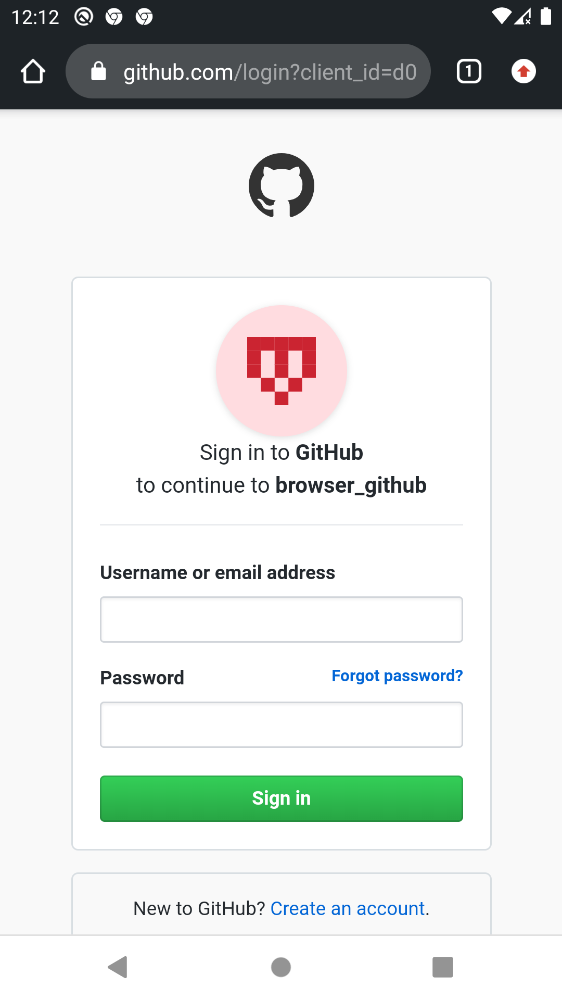

GitHub Browser
==============

# Features

Simple GitHub user and repository browser.

The application is able to search for users and show their repositories with additional information.

After login, the user is landed on the user screen.

The user screen has avatar, username, number of followers and the number of people the user is following.

List of the user's and starred repositories.

The "Followers" and "Following" are clickable and when clicked on, open a list of corresponding users.

A search icon, on which when clicked, a user may filter the results.

When clicked on any repository item on the list, a repository screen opens.

It has contributors and owner button which navigate to appropriate screens.

Star/Unstar functionality is also included.

There is also bottom menu with "Home", "Search" and "Logout" items.

All data is cached on the device for offline access.

# Screenshots

### Login & GitHub oauth

  
  

### Home & User profile

  
  

### User own & starred repositories

  
  

### User followers & following

  
  

### Repository profile & contributors

  
  

### Search & Search types

  
  

### Search repositories & users

  
  

# Development Environment

The app is written entirely in Kotlin and uses the Gradle build system.

To build the app, use the `gradlew build` command or use "Import Project" in
Android Studio. `MinSdkVersion` is 28.

# Architecture

The architecture is built around
[Android Architecture Components](https://developer.android.com/topic/libraries/architecture/).

Followed the recommendations laid out in the
[Guide to App Architecture](https://developer.android.com/jetpack/docs/guide)
when deciding on the architecture for the app. Logic is kept away from
Activities and Fragments and moved to
[ViewModel](https://developer.android.com/topic/libraries/architecture/viewmodel)s.
Observed data using
[LiveData](https://developer.android.com/topic/libraries/architecture/livedata)
and [Data Binding Library](https://developer.android.com/topic/libraries/data-binding/)
to bind UI components in layouts to the app's data sources. [Room](https://developer.android.com/topic/libraries/architecture/room) is used for offline storage.

Repository layer is used for handling data operations. Data comes
from a [GitHub API](https://api.github.com/) and is fetched on the go.
The repository modules are responsible for handling all data operations and abstracting the data sources
from the rest of the app. (if we wanted to swap the API for a different data source in the future,  
the architecture allows to do so in a clean way).

Implemented a lightweight domain layer, which sits between the data layer
and the presentation layer, and handles discrete pieces of business logic off
the UI thread. See the `UseCase.kt` files under `/domain` for
[examples](https://github.com/ivzb/github_browser/search?q=UseCase&unscoped_q=UseCase).

Used [Navigation component](https://developer.android.com/guide/navigation)
to simplify into a single Activity app.

Used [Dagger2](https://github.com/google/dagger) for dependency injection
and heavily relied on
[dagger-android](https://google.github.io/dagger/android.html) to abstract away
boiler-plate code.
